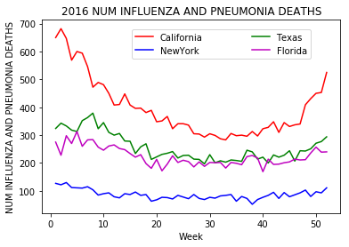
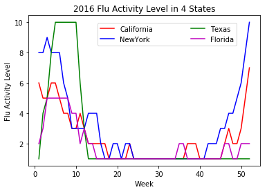

## Flu activity level and the number of Mortality caused by Influenza and Pneumonia in 2016       
 

As expected, the flu activity level shows the similar trend as the mortality number during the year 2016 for all the states. During the winter and spring, the flu epedemic will lead to more hospitalization. The elderly are at greater risk of seasonal influenza complications and death. 

However, the flu vaccine taken data is not taken into account to explain the mortality. 
