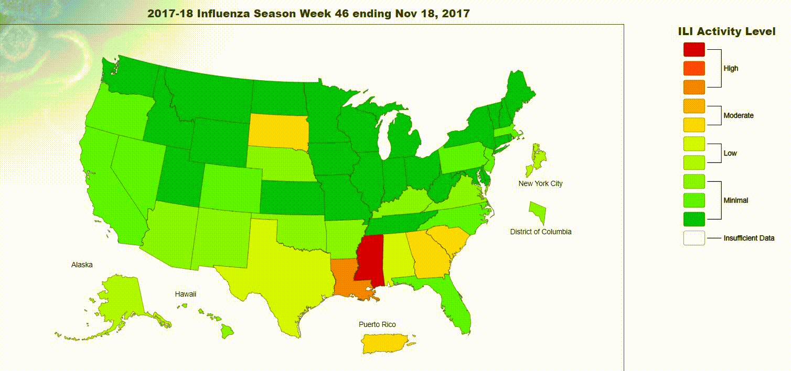

# Flu Vaccination Efficacy Evaluation

Every year, prevention and control of influenza epidemics is a big challenge. Influenza vaccination is used to prevent influenza. This project uses machine learning methods to predict the efficacy of vaccine for preventing death caused by Influenza and pneumonia.

# Flu is almost around everywhere in 2018. 

 

Influenza (flu) is a mostly widely-spread contagious illness that occurs every season on everyone. Seasonal flu is a serious disease that causes illness, hospitalizations, and deaths every year in the United States. 
Influenza could lead to influenza-related death every year occur in people for whom seasonal influenza infection was likely a contributor to the cause of death. CDC estimates that flu-associated deaths ranged from a low of about 3,000 to a high of about 49,000 people. 
While we all can get flu, people are more likely to experience severe flu illness, such as young children, adults aged 65 years and older, pregnant women, and people with certain chronic medical conditions.

The question on how well the flu vaccine protects against flu illness is crucial. This project is proposed to explore the efficacy of flu vaccine by data analysis of past year's flu level, flu-associated death, and flu vaccine taken by adults aged 65+ who have had a flu shot.

# Approaches
Data Mining
Machine Learning
# Data sources

### A Weekly Influenza Surveillance Report Prepared by the Influenza Division, Influenza-Like Illness (ILI) Activity Level Indicator Determined by Data Reported to ILINet
### Behavioral Risk Factor Surveillance System (BRFSS) data
### Pneumonia and Influenza Mortality Surveillance from the National Center for Health Statistics Mortality Surveillance System

